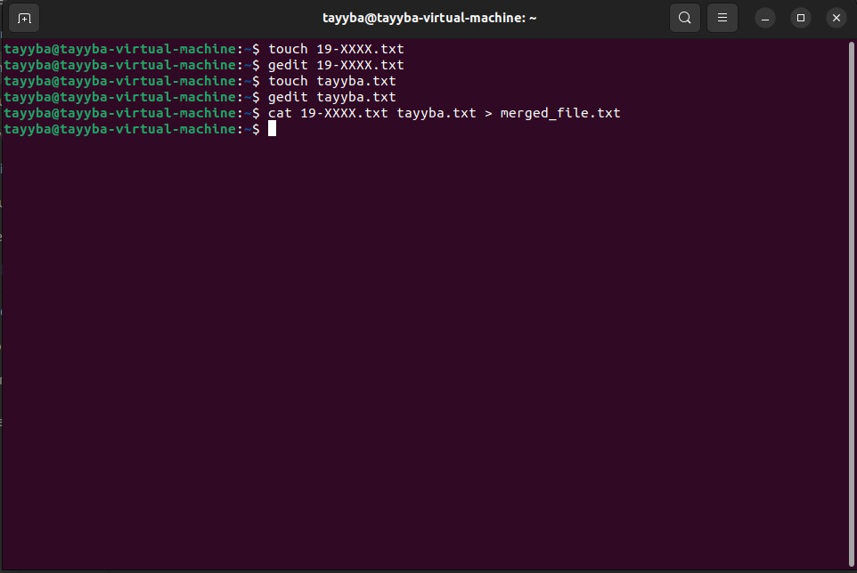
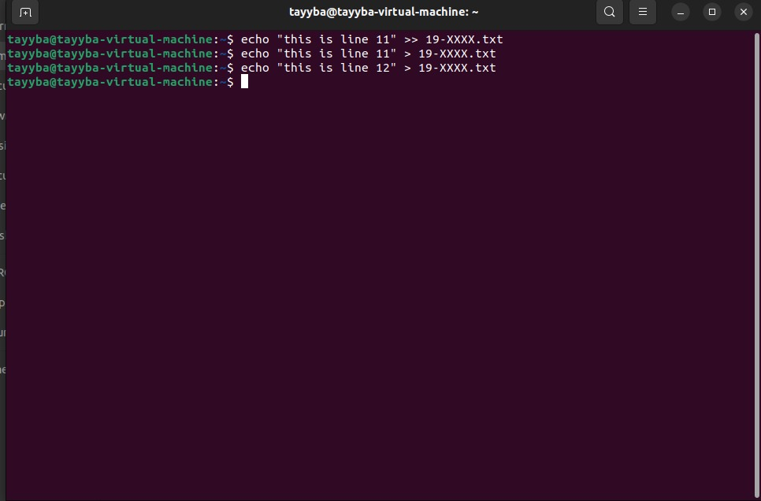
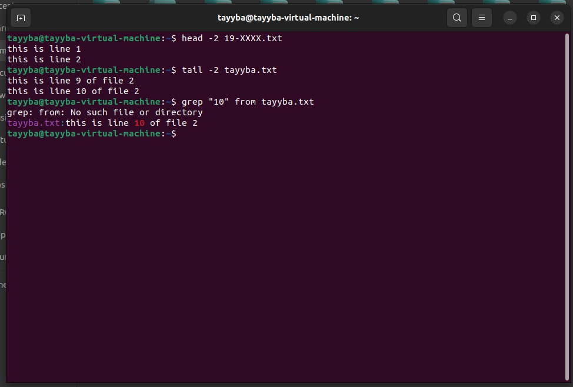
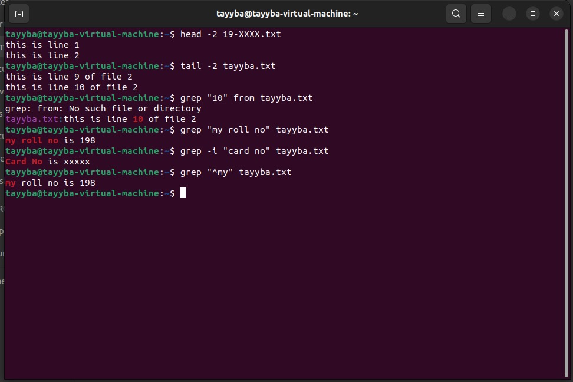
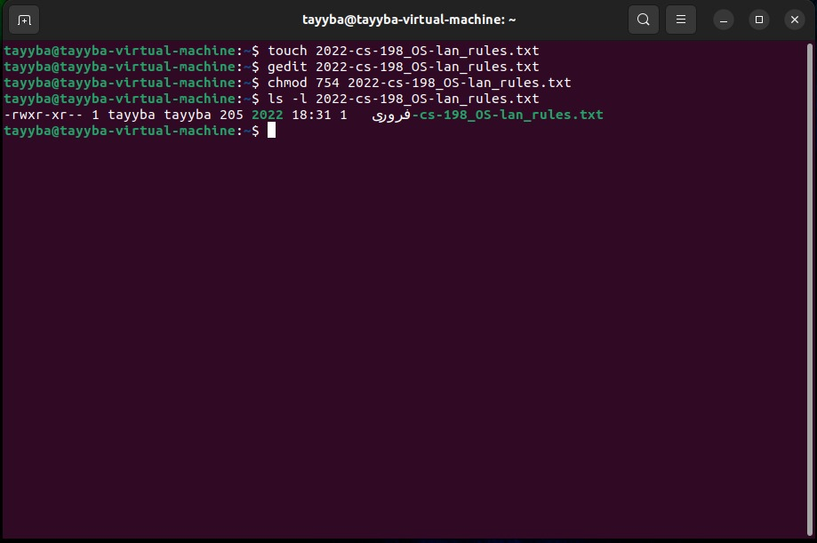
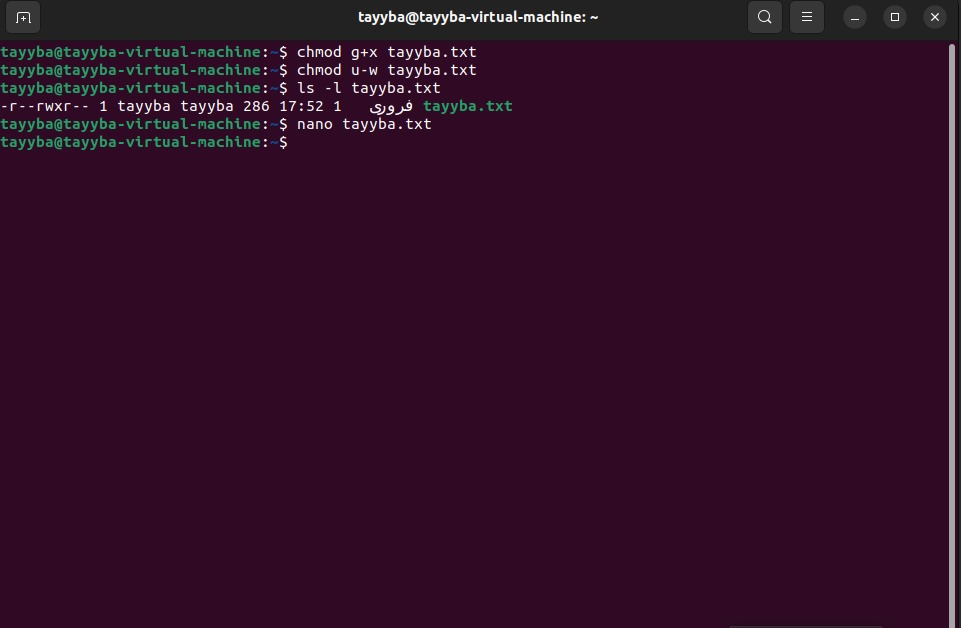
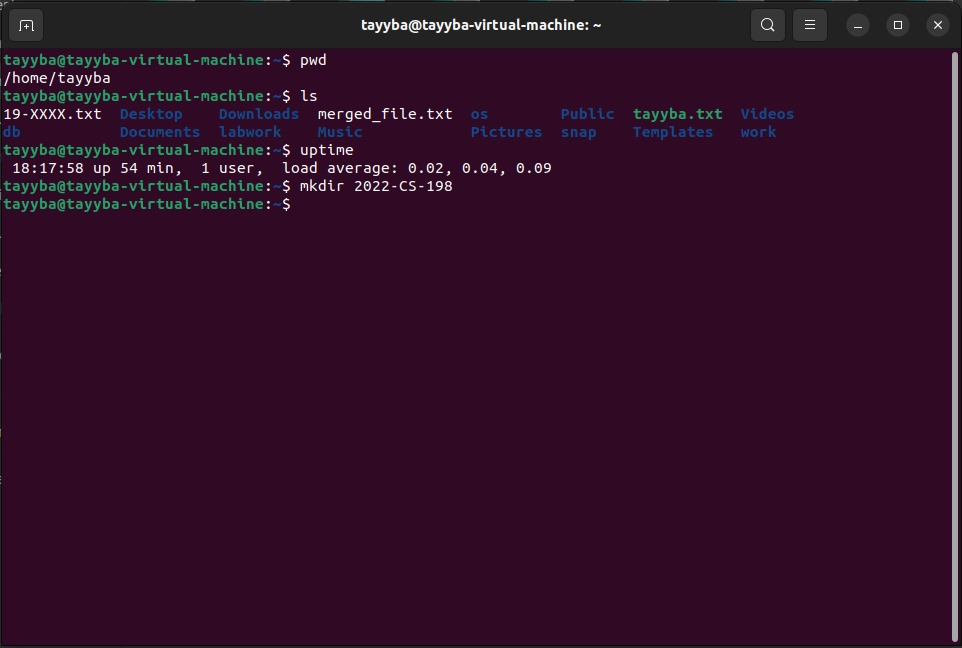
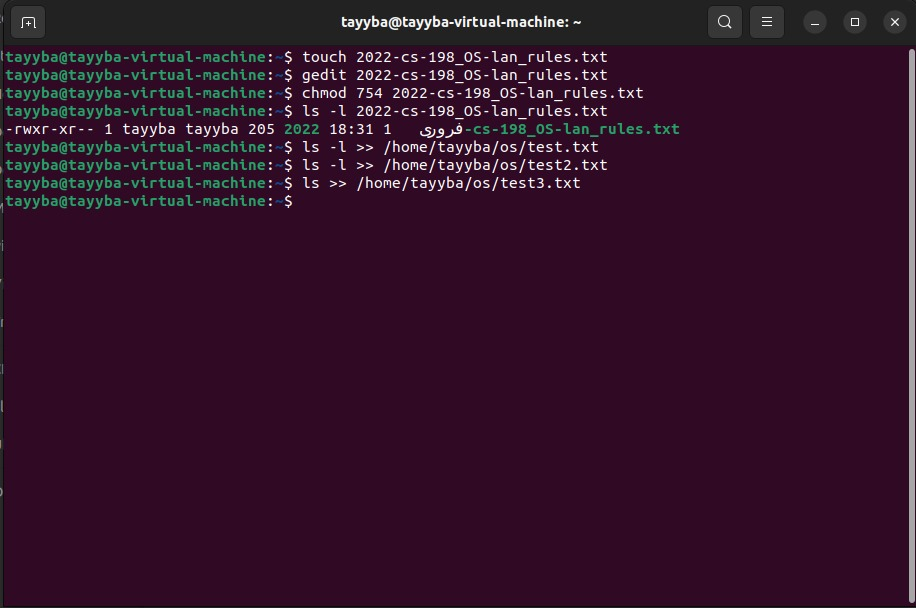
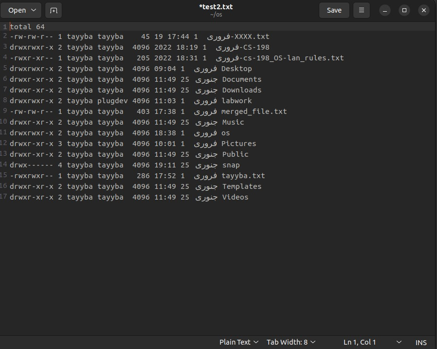
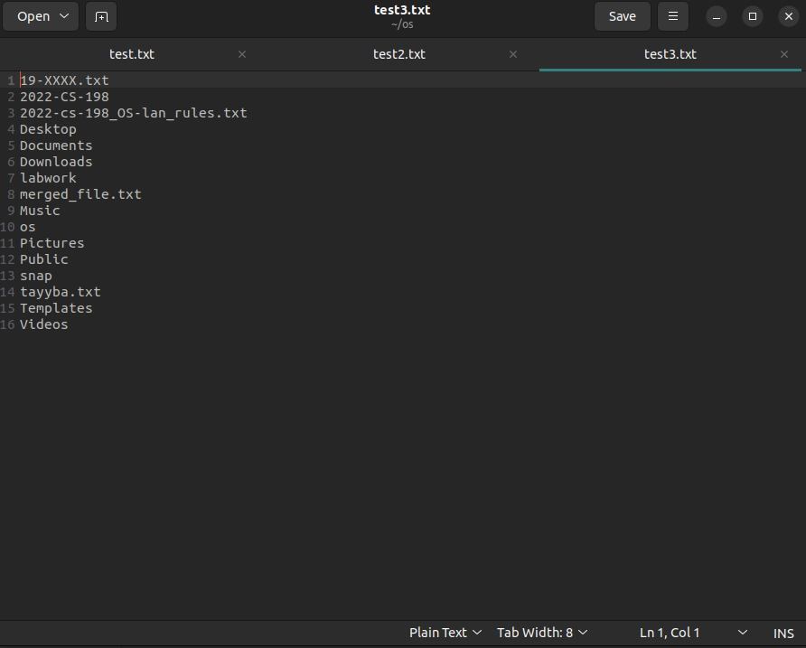

# Linux Shell Commands

- #### touch: 

  - touch command is use to create a file.

  - $ touch [filename].[extension]
    -  touch test.cpp

- #### gedit , nano: 

  - These commands are use to open file in editor to write content in file.
  -   $ gedit [filename].[extension]
    -  gedit  test.cpp
  -   $ nano [filename].[extension]
    - nano  test.cpp

  ​               

- #### cat: 

  - cat command is use to show the content of file.
  - $ cat [filename].[extension]
    -  cat  test.cpp

#### Another method to create file, merge the content of different files into new file 

- #### cat, >, >>: 

  - **cat** command show the content of file and also use to merge more than one files content into other file.

  - $ cat [filename].[extension]

    - cat  test.cpp

  - **'>'** this command is use to write data in file in overwrite mode.

  - **'>>'** this command is use to write data in file in append mode.

    

- #### Merge data command:

  - $cat [file1name].[extension] [file2name].[extension] [>, >>] [destinationFileName].[extension]
    - cat file1.txt file2.txt > mergedfile.txt
  - This will automatically create merged.txt if does not exist.

- #### Another method to write content in file without opening editor

- #### echo**:

  - echo "your data" [>, >>] [filename].[extension]
    - echo "My name is tayyba" > test.txt
    - echo "I am creating a readme file"  >> test.txt

  - This will automatically create the file "test.txt" if  does not exist.

    

#### Command to display specific lines data from file

- **head**:

  - head command use to display data from the first line. If we don't specify the number of lines it will automatically display first 10 lines of file and if amount is specified it will display that much number of lines.
  - head [amount(optional)] [filename].[extension]
    - head -2 test.txt (this will display first 2 lines data)

- **tail**:

  - tail command use to display data from the last line. If we don't specify the number of lines it will automatically display last 10 lines of file and if amount is specified it will display that much number of lines.

  - tail [amount(optional)] [filename].[extension]

    - tail -2 test.txt (this will display last 2 lines data)

      

  

#### Command to find a string in a file

- **grep**:
  - grep "string" [filename].[extension]
    - grep "name" test.txt

If you want to search some word and **not want it to be case sensitive** then you can use this command:

- **grep -i**
  - grep -i "string" [filename].[extension]
    - grep -i  "name" test.txt
    - now if the word in file is "Name" it will also consider it as "name".

There is one more kind of search we can do with this command. If we write **"^"** this symbol with our string it will **search for the the line** starting with the provided string value.

- grep  "^string" [filename].[extension]

  - grep -i  "^name" test.txt

    

#### Access permission command for files(task2 also covered)

- **chmod**

  - This command can be used in two different ways:

    1. Use numbers to grant permissions: 
       1. for **read** number **4** 
       2. for **write** number **2** 
       3. for **execute** number **1** 

    Pattern is like this:

      user(owner)                       groups                    others

    4(r)+2(w)+1(e)                 4(r)+2(w)+1(e)        4(r)+2(w)+1(e)  

  - chmod 754 [file].[extension]

    - chmod 754 test.txt
    - 754 means all permissions to user read+write to group and only read to others.

    

2. Use numbers to grant permissions: 
   1. for **read** number **r**
   2. for **write** number **w**
   3. for **execute** number **x** 

Pattern is like this:

  user(owner)       groups         others

​     r+w+x               r+w+x         r+w+x  

- chmod u+rwx g+rw o+r [file].[extension]

  - chmod u+rwe g+rw o+r test.txt

  -  u+rwx g+rw o+r means all permissions to user read+write to group and only read to others.

  

- #### pwd: 

  - pwd command is use to display current directory path.
    - $ pwd

- #### ls: 

  - ls command is use to display all files and folders of current directory.
    - ls

- #### mkdir: 

  - mkdir command is use to create new directory.

  - $ mkdir [foldername]
    -  mkdir OSlab

- #### uptime: 

  - uptime command is use to display current date time.

    - $ uptime

      

- #### Append output of ls, ls -l command to a file

  - ls [filename].[extension] >> [detination file name/ path]

  

- File creation and view using ls -l command:

  

- File creation and view using ls command:

  

- #### Git repository link:

  https://github.com/Tayyba80/OSlabs.git